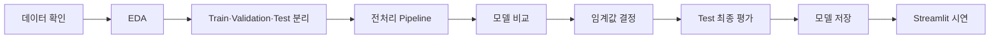

괜찮아요. 이 데이터셋은 고객 이탈 예측을 처음 연습하기에 꽤 좋은 편입니다. 은행 고객 1명당 한 행이 있고, `Exited`가 이탈 여부를 나타내는 이진 분류 문제입니다. Kaggle에는 CSV 1개, 14개 컬럼으로 소개되어 있습니다. [Kaggle 데이터셋 설명](https://www.kaggle.com/datasets/shrutimechlearn/churn-modelling)

발표가 2026년 7월 22일이므로, 복잡한 딥러닝보다 “분석부터 실제 예측 화면까지 완성된 프로젝트”를 목표로 잡는 것이 좋습니다.

## 1. 프로젝트를 한 문장으로 정의하기

> 은행 고객의 인구통계·금융·계좌 이용 정보를 바탕으로 이탈 가능성을 예측하고, 위험 고객에게 적절한 유지 전략을 제안한다.

모델의 사용자와 행동도 정해두면 좋습니다.

- 사용자: 은행 고객관리 또는 마케팅 담당자
- 예측 결과: 고객별 이탈 확률
- 활용 방법: 위험 고객을 선별하여 상담, 수수료 혜택, 상품 점검 등의 유지 활동 수행
- 중요한 오류: 실제 이탈 고객을 놓치는 것, 즉 False Negative
- 우선 평가 지표: Recall
- 함께 볼 지표: Precision, F1-score, PR-AUC

## 2. 컬럼은 이렇게 이해하면 됩니다

일반적으로 이 데이터는 다음 컬럼으로 구성됩니다.

| 컬럼 | 의미 | 모델 사용 |
|---|---|---|
| `RowNumber` | 단순 행 번호 | 제거 |
| `CustomerId` | 고객 식별자 | 제거 |
| `Surname` | 고객 성 | 제거 |
| `CreditScore` | 신용점수 | 사용 |
| `Geography` | 국가 | 사용 |
| `Gender` | 성별 | 사용 |
| `Age` | 나이 | 사용 |
| `Tenure` | 가입 기간 | 사용 |
| `Balance` | 계좌 잔액 | 사용 |
| `NumOfProducts` | 이용 상품 수 | 사용 |
| `HasCrCard` | 신용카드 보유 여부 | 사용 |
| `IsActiveMember` | 활동 고객 여부 | 사용 |
| `EstimatedSalary` | 추정 급여 | 사용 |
| `Exited` | 이탈 여부, 1=이탈 | 정답값 |

`CustomerId`, `Surname`, `RowNumber`는 고객의 행동이나 상태를 의미하지 않으므로 입력 변수에서 제외합니다.

## 3. 전체 진행 순서



### ① 데이터 확인

우선 다음 항목을 확인합니다.

- 전체 행과 열 개수
- 결측치와 중복값
- 데이터 타입
- 이상한 값의 존재
- `Exited`의 0과 1 비율

```python
import pandas as pd

df = pd.read_csv("data/raw/Churn_Modelling.csv")

print(df.shape)
print(df.head())
print(df.info())
print(df.isnull().sum())
print("중복:", df.duplicated().sum())
print(df["Exited"].value_counts())
print(df["Exited"].value_counts(normalize=True))
```

### ② EDA

발표에는 그래프를 많이 넣기보다, 다음 5~7개 정도만 명확하게 보여주면 됩니다.

- 전체 이탈률
- 국가별 이탈률
- 성별 이탈률
- 연령대별 이탈률
- 활동 고객 여부별 이탈률
- 이용 상품 수별 이탈률
- 잔액 분포와 이탈 관계

예:

```python
df.groupby("Geography")["Exited"].mean().sort_values(ascending=False)
df.groupby("Gender")["Exited"].mean()
df.groupby("IsActiveMember")["Exited"].mean()
df.groupby("NumOfProducts")["Exited"].mean()
```

발표에서는 이렇게 말하면 됩니다.

> 비활동 고객의 이탈률이 더 높게 관찰되었다. 다만 이는 인과관계를 증명하는 것이 아니라 고객 위험군을 구분하는 패턴이다.

### ③ 데이터 분리

Train 60%, Validation 20%, Test 20% 정도가 이해하기 쉽습니다. `stratify`를 사용해 각 데이터에 이탈 고객 비율이 비슷하게 유지되도록 합니다.

```python
from sklearn.model_selection import train_test_split

X = df.drop(
    columns=["RowNumber", "CustomerId", "Surname", "Exited"]
)
y = df["Exited"]

X_train, X_temp, y_train, y_temp = train_test_split(
    X, y,
    test_size=0.4,
    stratify=y,
    random_state=42
)

X_valid, X_test, y_valid, y_test = train_test_split(
    X_temp, y_temp,
    test_size=0.5,
    stratify=y_temp,
    random_state=42
)
```

Test 데이터는 마지막 평가 전까지 사용하지 않아야 합니다.

### ④ 전처리 Pipeline 만들기

- 숫자형: 결측치 중앙값 처리 및 표준화
- 범주형: 최빈값 처리 및 One-Hot Encoding
- 전처리와 모델을 하나의 Pipeline으로 결합

```python
from sklearn.compose import ColumnTransformer
from sklearn.impute import SimpleImputer
from sklearn.pipeline import Pipeline
from sklearn.preprocessing import OneHotEncoder, StandardScaler

numeric_features = [
    "CreditScore", "Age", "Tenure", "Balance",
    "NumOfProducts", "HasCrCard",
    "IsActiveMember", "EstimatedSalary"
]

categorical_features = ["Geography", "Gender"]

numeric_transformer = Pipeline([
    ("imputer", SimpleImputer(strategy="median")),
    ("scaler", StandardScaler())
])

categorical_transformer = Pipeline([
    ("imputer", SimpleImputer(strategy="most_frequent")),
    ("onehot", OneHotEncoder(handle_unknown="ignore"))
])

preprocessor = ColumnTransformer([
    ("num", numeric_transformer, numeric_features),
    ("cat", categorical_transformer, categorical_features)
])
```

## 4. 비교할 모델

처음부터 많은 모델을 사용할 필요는 없습니다.

1. `DummyClassifier`: 아무것도 학습하지 않은 기준선
2. `LogisticRegression`: 설명하기 쉬운 기본 모델
3. `RandomForestClassifier`: 비선형 관계를 학습하는 모델
4. `HistGradientBoosting`, XGBoost 또는 LightGBM 중 하나

발표 일정상 우선 세 모델만 완성해도 충분합니다.

```python
from sklearn.dummy import DummyClassifier
from sklearn.linear_model import LogisticRegression
from sklearn.ensemble import RandomForestClassifier

models = {
    "Dummy": DummyClassifier(strategy="prior"),
    "Logistic Regression": LogisticRegression(
        max_iter=1000,
        class_weight="balanced",
        random_state=42
    ),
    "Random Forest": RandomForestClassifier(
        n_estimators=300,
        class_weight="balanced",
        random_state=42
    )
}
```

처음에는 SMOTE를 쓰지 않는 것을 권합니다. 먼저 `class_weight="balanced"`로 실험한 후 결과가 부족할 때만 SMOTE를 추가하세요.

## 5. 모델 평가 방법

Accuracy만 보면 안 됩니다. 이탈 고객 비율이 낮으면 모든 고객을 “유지”라고 예측해도 정확도가 높게 나올 수 있기 때문입니다.

```python
from sklearn.metrics import (
    precision_score,
    recall_score,
    f1_score,
    average_precision_score
)

results = []

for name, model in models.items():
    pipeline = Pipeline([
        ("preprocessor", preprocessor),
        ("model", model)
    ])

    pipeline.fit(X_train, y_train)

    probability = pipeline.predict_proba(X_valid)[:, 1]
    prediction = (probability >= 0.5).astype(int)

    results.append({
        "model": name,
        "precision": precision_score(y_valid, prediction),
        "recall": recall_score(y_valid, prediction),
        "f1": f1_score(y_valid, prediction),
        "pr_auc": average_precision_score(y_valid, probability)
    })

results_df = pd.DataFrame(results)
print(results_df)
```

최종 모델은 보통 다음 기준으로 선택합니다.

> 이탈 고객을 충분히 찾아내는 Recall을 우선하되, 너무 많은 정상 고객에게 경고하지 않도록 Precision과 F1도 함께 고려한다.

## 6. 임계값도 모델의 일부입니다

기본 임계값은 0.5지만, 이탈자를 더 많이 찾으려면 0.35나 0.4처럼 낮출 수 있습니다.

```python
threshold = 0.4
prediction = (probability >= threshold).astype(int)
```

단, 임계값은 Validation 데이터에서 결정하고 Test에서는 변경하지 않아야 합니다.

예를 들어:

- 임계값 0.5: Recall 60%, Precision 70%
- 임계값 0.4: Recall 75%, Precision 58%

은행이 “다소 많은 고객에게 연락하더라도 이탈자를 놓치지 않겠다”고 판단하면 0.4가 더 적합할 수 있습니다.

## 7. Streamlit 화면

화면은 세 부분이면 충분합니다.

- 고객 현황과 주요 EDA
- 모델별 성능 및 Confusion Matrix
- 신규 고객 정보 입력과 이탈 확률 예측

개별 예측 화면에서는 다음처럼 보여주면 됩니다.

> 이 고객의 이탈 확률은 72%이며 고위험 고객입니다.  
> 활동 회원 여부와 상품 이용 상태를 확인하고 맞춤 상담을 권장합니다.

모델이 직접 “쿠폰을 제공하라”고 학습한 것은 아니므로, 유지 전략은 모델 예측과 별도로 정의한 업무 규칙이라고 설명해야 합니다.

## 8. 발표일까지 추천 일정

- 7월 14일: 데이터 다운로드, 컬럼 확인, 프로젝트 구조 생성
- 7월 15일: EDA와 핵심 인사이트 정리
- 7월 16일: 데이터 분리와 전처리 Pipeline
- 7월 17일: Dummy, Logistic Regression, Random Forest 비교
- 7월 18일: 최종 모델 및 임계값 선택
- 7월 19일: 모델 저장과 Streamlit 구현
- 7월 20일: README 및 발표 자료 제작
- 7월 21일: 전체 재실행, 시연 연습, 오류 수정
- 7월 22일: 발표

## 9. 이 데이터셋의 중요한 한계

이 부분을 발표에서 언급하면 프로젝트 완성도가 올라갑니다.

- 데이터의 정확한 수집 시점과 관찰 기간이 제공되지 않습니다.
- `Exited`가 언제 발생했는지 시간 정보가 없습니다.
- 공개 페이지의 라이선스가 `Unknown`으로 표시되어 있으므로 상업적 사용 근거가 불명확합니다.
- 고객 행동 로그가 적어 실제 금융기관의 이탈 예측보다 단순합니다.
- 관찰된 변수와 이탈의 연관성을 인과관계로 해석하면 안 됩니다.

따라서 이 프로젝트는 실제 운영 모델이 아니라 “은행 고객 이탈 예측 프로토타입”으로 소개하는 것이 정확합니다.

가장 좋은 목표는 딥러닝이나 최고 점수가 아니라, 데이터 분석부터 저장된 모델과 Streamlit 시연까지 끊김 없이 작동하는 결과물을 만드는 것입니다.